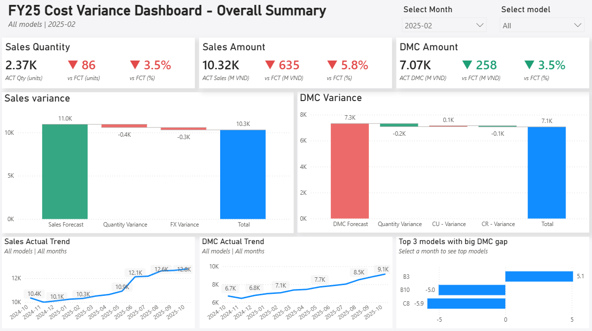
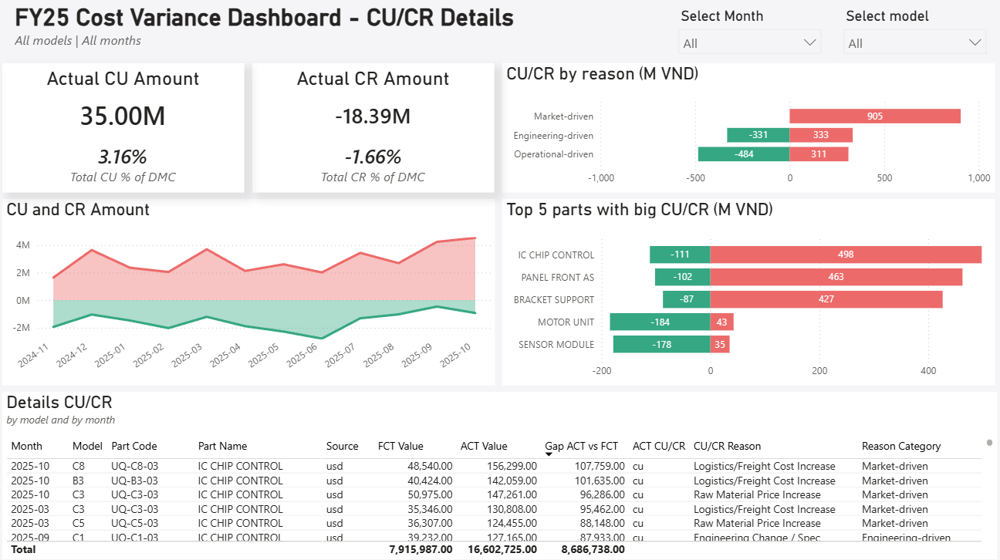

# Cost Variance Analysis

## Introduction

A portfolio project simulating a monthly Cost Variance Analysis workflow at a home-appliance manufacturing company. Built to practice SQL and Power BI, based on an analysis process the author actually performs at work every month (previously done in Excel/Power Query).

## Background

Every month, the company sets a **forecast** for production quantity and **DMC (Direct Material Cost)** for each product model. By month-end, **actual** figures always deviate from forecast. The Cost Management team's job is to:

1. **Measure the Gap between Forecast and Actual** for both Sales and DMC.
2. **Decompose the causes of the gap** - is it driven by a change in *production quantity* (Quantity Variance), a change in *component price* (CU/CR Variance), or *FX rate movement* (FX Variance)?
3. **Trace down to part-level** - which parts are experiencing **Cost Up (CU)** or **Cost Down (CR)**, and why (supplier negotiation, design change, or market conditions)?
4. **Assign accountability** - is a CR the result of internal effort (Purchasing/R&D — Operational-driven / Engineering-driven), or is a CU driven by external, uncontrollable market factors (Market-driven)?

This is a key report for leadership, as it shows whether the team is effectively controlling costs and how exposed the business is to market risk.

## Dataset
**All data in this project is fully synthetic**. It does not represent real figures from any company, for confidentiality reasons.

### Tables

| Table | Description |
|---|---|
| `bom_data` | Part-level price movement, by model, by month, by version (forecast/actual). Includes the reason for each change (`reason`) and its category (`reason_category`). |
| `model_master` | Fixed attributes per model: category, market, standard cost, selling price (`exf`), USD/JPY import share. |
| `fx_rate` | Monthly USD/JPY exchange rates, separated by forecast and actual. |
| `quantity` | Production quantity by model, by month, forecast and actual. |

## Data Architecture

The data model follows a simple **star schema**:
- **Dimensions:** `dim_month` (month list), `model_master` (model/category/market attributes)
- **Facts:** `bom_data`, `quantity`, `fx_rate`

## Key Findings

*Page 1 — Overview: Sales & DMC variance at a glance, with dynamic waterfall breakdown by quantity, FX, and cost variance.*

*Page 2 — CU/CR Details: variance broken down by reason category (Market/Operational/Engineering-driven), part-level, and model/month drilldown.*

- **Concentration risk from shared parts (platform sharing):** some parts are shared across up to 15 models at once. Therefore, any price movement in these parts immediately ripples across multiple product lines, rather than staying contained to a single model.
- **Category C shows the highest total DMC variance for the year**, largely driven by model C8, whose actual volume exceeded plan (+9.4%), showing how volume variance and cost variance can compound one another.
- **Clear separation of CU/CR accountability by cause:** most CR (cost down) stems from internal effort (negotiation, design improvement, ...), while CU (cost up) is mostly driven by external market factors, reflecting the real business need to distinguish "team performance" from "external risk."

## Tools

- **MySQL**
- **Power BI Desktop**
- **Git / GitHub**