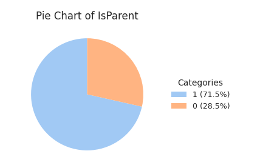
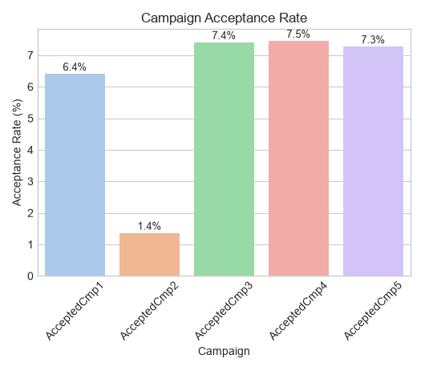
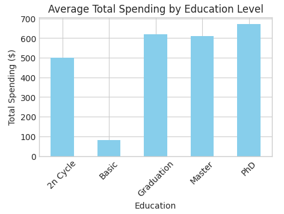
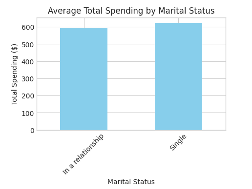
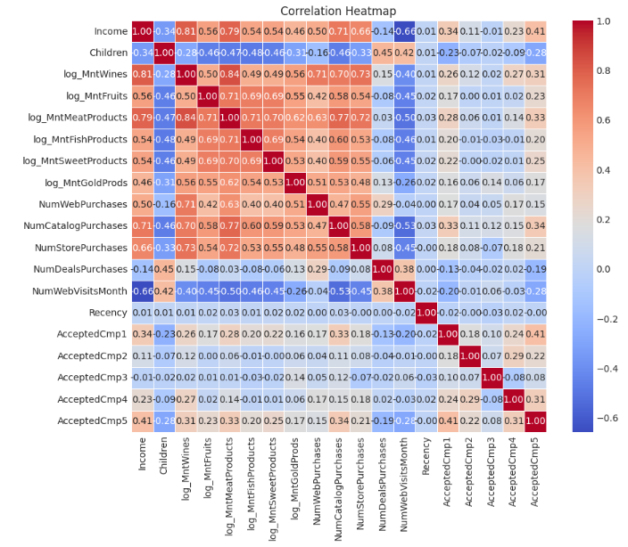
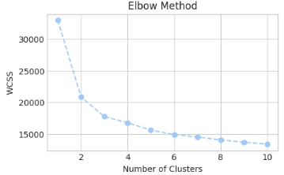
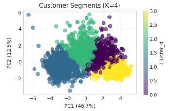

# Customer Personality Analysis

## Introduction

### Background
Customer Personality Analysis is a detailed examination of a company's ideal customers. It enables businesses to better understand their customer base and adapt products to meet the specific needs, behaviors, and concerns of different customer segments.

### Dataset
This project analyzes the **Customer Personality Analysis** dataset from [Kaggle](https://www.kaggle.com/datasets/imakash3011/customer-personality-analysis), provided by Dr. Omar Romero-Hernandez.

The dataset contains information across four key dimensions:
- **People**: Customer demographics (education, marital status, household composition)
- **Products**: Spending on various product categories over the last 2 years
- **Promotion**: Customer responses to marketing campaigns
- **Place**: Purchase channels and customer touchpoints

### Objective
By understanding customer personality segments, businesses can optimize their marketing strategies and product offerings. Rather than implementing broad marketing campaigns, companies can target specific segments most likely to respond, improving ROI and customer satisfaction.

### Approach
**Clustering Analysis** using the Elbow Method to identify optimal customer segments.

---

## Exploratory Data Analysis

### Dataset Overview 
- **Size**: 2,240 customers × 29 features 
- **Data Quality**: No duplicates; 24 missing values (MCAR, dropped)

### Key Findings from EDA

#### 1. Customers are predominantly established households

**Insight:** 71% of customers have children at home, and 64.6% are in a relationship — the customer base skews toward established family households rather than single, childless individuals.

#### 2. Engagement with the company is generally low

**Insight:** Only 0.9% of customers have ever filed a complaint, but marketing campaign acceptance is also low across the board — Campaign 4 performs best at just 7.5% acceptance, and Campaign 2 the worst at 1.3%. Low complaints paired with low campaign response suggests a largely passive customer base rather than an actively dissatisfied one.

#### 3. Higher education strongly predicts higher spending — marital status barely does

| Education | Income | Total Spending |
|---|---|---|
| Basic | $20,306 | $82 |
| 2n Cycle | $47,625 | $499 |
| Graduation | $52,139 | $620 |
| Master | $53,011 | $609 |
| PhD | $55,668 | $673 |

**Insight:** Spending swings **97.6%** between the lowest and highest education tier — education is a meaningful segmentation driver. By contrast, spending only differs **4.8%** between "Single" and "In a relationship" customers ($624 vs. $595) — marital status alone barely differentiates spending behavior, which is why it was excluded from the clustering features.

#### 4. Income and spending are strongly linked — but more children pulls spending down

**Insight:** Income correlates strongly with spending (Income–Wine spending: r = 0.81, Income–Meat spending: r = 0.79), while number of children correlates *negatively* with both income (r = -0.34) and spending across nearly every category (r = -0.28 to -0.47) — households with more children spend less even at similar income levels, likely reflecting competing budget priorities.

#### 5. Distribution shape and outlier handling

**Insight:** Age is slightly right-skewed (majority 48–65 years old, a predominantly middle-aged customer base), Recency is roughly uniform (0–99 days since last purchase), and Income is right-skewed with a long tail of high earners (majority between $35,303–$68,413/month). A small number of extreme outliers (e.g., one customer reporting $666,666/month income) were dropped, while product-spending outliers were kept and log-transformed instead of removed, since they likely represent genuine premium buyers rather than data errors.

*For the full breakdown (education/marital status distribution, campaign-by-campaign response, boxplots per numeric column), see the notebook.*

---

## Clustering Analysis

### Optimal Cluster Selection

**Elbow Method Result**: K = 4 clusters identified as optimal

## Cluster Profiles

### Cluster 0: Affluent Parents - Digital-First Shoppers (19.3%, n=425)

**Demographics**
- Income: $63,388 (above average)
- 85.9% have children (avg: 0.96)
- Education: 55.8% Graduation, 20.5% PhD
- Recency: 49.5 days

**Spending Behavior**
- Total: $951
- Top categories: Wines ($509), Meat ($210)
- Balanced spending across all categories

**Channel Preferences**
- Strong omnichannel presence
- Web purchases: 6.6 | Store: 8.9 | Catalog: 3.8
- Moderate deal usage (2.9)
- Web visits: 5.1

---

### Cluster 1: Budget-Conscious Families (38.0%, n=837)

**Demographics**
- Income: $32,850 (**LOWEST**)
- 87.8% have children (avg: 1.23 - highest per household)
- Education: 49.2% Graduation, 18.5% PhD
- Recency: 48.9 days

**Spending Behavior**
- Total: $63 (**LOWEST** - only 4.6% of premium segment)
- Minimal spending across all categories
- Wines: $24 | Meat: $15

**Channel Preferences**
- Highest web visits (6.4) but minimal purchases (1.7)
- Very low catalog usage (0.4)
- Minimal store visits (2.9)
- Price-sensitive with limited purchasing power

---

### Cluster 2: Middle-Income Deal-Seeking Families (21.0%, n=462)

**Demographics**
- Income: $49,904 (middle tier)
- 94.6% have children (avg: 1.32 - **HIGHEST percentage**)
- Education: 44.6% Graduation, 27.9% PhD
- Recency: 48.0 days (**best engagement**)

**Spending Behavior**
- Total: $469 (moderate)
- Wines: $321 | Meat: $76
- Price-conscious but willing to spend with promotions

**Channel Preferences**
- **Highest deal dependency** (4.1) - most price-sensitive
- Highest web visits (6.7) - active researchers
- Digital-first with moderate omnichannel usage
- Web: 5.4 | Store: 5.7 | Catalog: 2.0

---

### Cluster 3: Premium Childless Professionals (21.6%, n=476)

**Demographics**
- Income: $76,871 (**HIGHEST**)
- Only 7.8% have children (avg: 0.08 - predominantly childless/empty nesters)
- Education: 53.8% Graduation, 21.6% PhD
- Recency: 50.2 days

**Spending Behavior**
- Total: $1,382 (**HIGHEST** - 22× Cluster 1)
- Premium spending across ALL categories
- Wines: $607 | Meat: $473 | Fish: $96

**Channel Preferences**
- Lowest web visits (2.3) - decisive buyers, not browsers
- **Highest catalog purchases** (6.1) - traditional preference
- Lowest deal dependency (1.0) - willing to pay full price
- Strong store presence (8.2)

## Key Insights & Recommendations

### Cluster 0: Affluent Parents - Digital-First Shoppers
**Marketing Strategy**
- Omnichannel marketing emphasizing convenience and quality
- Focus on premium family-oriented products
- Highlight time-saving benefits and product quality

**Product Focus**
- Premium wines and meats
- Family-size packages with quality emphasis
- Specialty items for entertaining

**Channel Strategy**
- Balanced investment across web, store, and catalog
- Mobile-optimized shopping experience
- Loyalty program with exclusive benefits

---

### Cluster 1: Budget-Conscious Families
**Marketing Strategy**
- Value-focused messaging
- Emphasize affordability and practicality
- Build trust through transparent pricing

**Product Focus**
- Budget-friendly essentials
- Multi-pack deals and family bundles
- Private label alternatives

**Channel Strategy**
- Optimize web-to-purchase conversion
- Simplified checkout process
- Clear value propositions and savings indicators
- Email campaigns with budget-friendly tips

---

### Cluster 2: Middle-Income Deal-Seeking Families
**Marketing Strategy**
- Targeted promotions and limited-time offers
- Comparison shopping tools
- Price-match guarantees

**Product Focus**
- Mid-tier products with strong value proposition
- Bundle deals combining necessities with treats
- Seasonal promotions

**Channel Strategy**
- Digital-first approach with push notifications
- Deal aggregation and personalized offers
- Shopping list features with deal alerts
- Weekly flyer integration

---

### Cluster 3: Premium Childless Professionals
**Marketing Strategy**
- Premium positioning and exclusivity
- Personalized service and convenience
- Quality and craftsmanship narratives

**Product Focus**
- High-end specialty items across all categories
- Gourmet and artisanal products
- Limited edition and premium selections
- Wine club and specialty subscriptions

**Channel Strategy**
- Enhanced catalog experience with premium presentation
- In-store personal shopping services
- Concierge-level customer service
- Streamlined reordering for favorites

## Tools & Libraries

- Python
- Pandas, NumPy
- Scikit-learn (K-Means Clustering)
- Matplotlib, Seaborn
- Jupyter Notebook