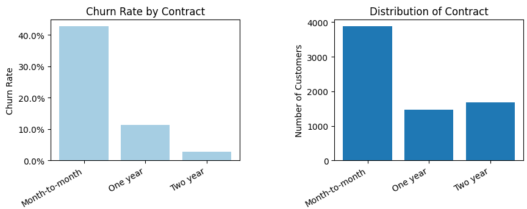
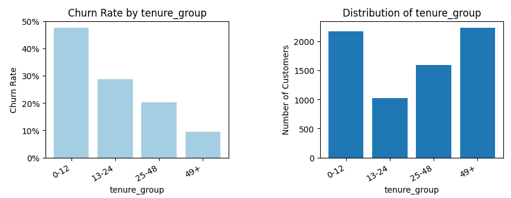
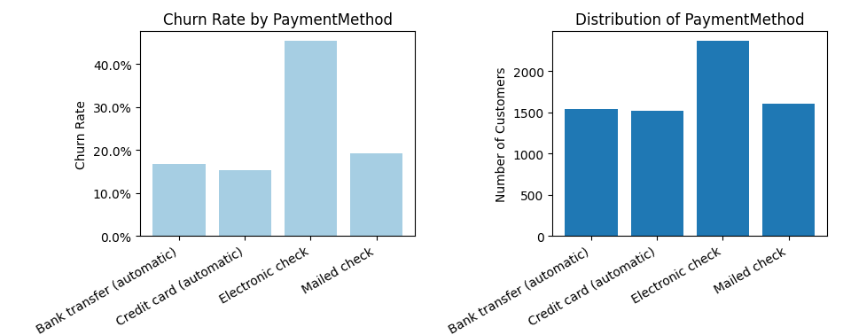
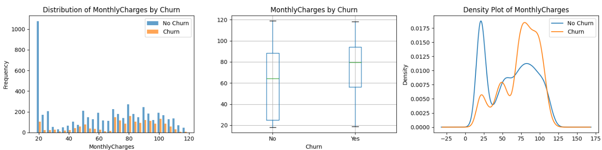
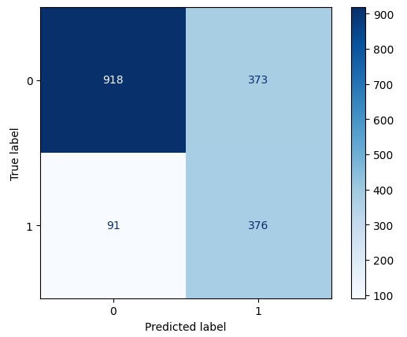

# Telco Customer Churn

# **Introduction**

## Background

Customer churn is a critical challenge in the telecommunications industry. Acquiring new customers costs significantly more than retaining existing ones.

> "The acquisition cost is 5 times that of the retention cost."  
> — Sharmila K. Wagh et al., 2023

With massive amounts of customer data generated daily, predicting churn becomes essential for maintaining profitability and sustainable growth.

## Dataset
This project analyzes the **Telco Customer Churn dataset** from [Kagglehub](https://www.kaggle.com/datasets/blastchar/telco-customer-churn/data), which contains information about:
- Customer demographics (gender, age, dependents)
- Services subscribed (phone, internet, streaming)
- Account information (contract type, payment method, tenure)
- Churn status (whether customer left within the last month)

## Objective
Predict which customers are likely to churn, enabling the company to:
- Identify at-risk customers early
- Develop targeted retention strategies
- Reduce customer attrition and increase lifetime value

## Approach
This project compares two modeling approaches:
1. **Logistic Regression**: Traditional statistical approach
2. **Tree-based Models**: Decision Tree and Random Forest

By comparing these methods, we aim to find the most effective model for churn prediction.

# EDA

## Dataset Overview 
-  **Size:** 7,043 customers, 21 features 
- **Target variable:** Churn (Yes/No) 
-  **Class distribution:** 73% non-churn, 27% churn (imbalanced) 
-  **Data quality:** No missing values, no duplicates

## Key Findings from EDA 
### 1. Contract Type is the Strongest Predictor 

**Insight:** Month-to-month contracts show 42% churn rate, significantly higher than one-year (11%) and two-year (3%) contracts. 
### 2. Early Customers are at Highest Risk

**Insight:** Customers with tenure < 12 months account for 50% of all churns. Early customer engagement is critical.
### 3. Payment Method Matters

**Insight:** Electronic check users churn at 45%, much higher than other payment methods (15-18%).
### 4. Higher Charges Correlate with Churn 

**Insight:** Churned customers pay an average of $74/month, compared to $61/month for retained customers.

*For detailed analysis, see the full notebook.*

# Logistics Regression Model
### Confusion Matrix

### Confusion Matrix Interpretation

- **True Positive (TP) = 376**  
  Customers who actually churned and were correctly predicted as churn.  
  → The model successfully identified these churners.

- **True Negative (TN) = 918**  
  Customers who did not churn and were correctly predicted as non-churn.  
  → The model correctly identified loyal customers.

- **False Positive (FP) = 373**  
  Customers who did not churn but were incorrectly predicted as churn.  
  → Type I Error (False Alarm).

- **False Negative (FN) = 91**  
  Customers who actually churned but were incorrectly predicted as non-churn.  
  → Type II Error (Missed Detection).

### Classification Report
| Metric | Non-Churn | Churn | 
|-----------|-----------|-------| 
| Precision | 0.91 | 0.5 | 
| Recall | 0.71 | 0.81 | 
| F1-Score | 0.80 | 0.62 |

**→ Overall Accuracy:** 0.74

### Key Observations

- The model achieves high recall (0.81) for churn customers, meaning it captures most churners.
- Precision for churn is relatively low (0.50), indicating a higher number of false positives.
- This behavior is acceptable in churn prediction scenarios where missing a churner is more costly than a false alarm.

# Tree-based Model

## Round 1: Include all variables as features
### Decision Tree 
-  **Best CV Score (AUC):** 0.82  
-   **Best Parameters:**  `max_depth=4, min_samples_leaf=2, min_samples_split=2` 
- **Test Set Performance:** 

| Metric | Non-Churn | Churn | 
|-----------|-----------|-------| 
| Precision | 0.81 | 0.63 | 
| Recall | 0.92 | 0.39 | 
| F1-Score | 0.86 | 0.48 |

**→ Overall Accuracy:** 0.78

### Random Forest 
-  **Best CV Score (AUC):** 0.82  
-   **Best Parameters:**  `max_depth=4, min_samples_leaf=2, min_samples_split=2` 
- **Test Set Performance:** 

| Metric | Non-Churn | Churn | 
|-----------|-----------|-------| 
| Precision | 0.83 | 0.64 | 
| Recall | 0.90 | 0.47 | 
| F1-Score | 0.86 | 0.54 |

**→ Overall Accuracy:** 0.79

## Round 2:  Incorporate feature engineering to build improved models
### Decision Tree 
-  **Best CV Score (AUC):** 0.82  
-   **Best Parameters:**  `max_depth=4, min_samples_leaf=2, min_samples_split=2` 
- **Test Set Performance:** 

| Metric | Non-Churn | Churn | 
|-----------|-----------|-------| 
| Precision | 0.82 | 0.60 | 
| Recall | 0.89 | 0.45 | 
| F1-Score | 0.85 | 0.52 |

**→ Overall Accuracy:** 0.78

### Random Forest 
-  **Best CV Score (AUC):** 0.82  
-   **Best Parameters:**  `max_depth=4, min_samples_leaf=2, min_samples_split=2` 
- **Test Set Performance:** 

| Metric | Non-Churn | Churn | 
|-----------|-----------|-------| 
| Precision | 0.81 | 0.63 | 
| Recall | 0.92 | 0.39 | 
| F1-Score | 0.86 | 0.48 |

# Key Findings

## Model Performance Comparison

| Model | CV AUC | Test Accuracy | Churn Precision | Churn Recall | Churn F1 | 
|------------------------|--------|---------------|-----------------|--------------|----------| 
| Logistic Regression | 0.XX | 0.74 | 0.50 | 0.81 | 0.62 | 
| Decision Tree (R1) | 0.82 | 0.78 | 0.63 | 0.39 | 0.48 | 
| Random Forest (R1) | 0.84 | 0.79 | 0.64 | 0.47 | 0.54 | 
| Decision Tree (R2) | 0.82 | 0.78 | 0.60 | 0.45 | 0.52 | 
| Random Forest (R2) | 0.83 | 0.79 | 0.63 | 0.48 | 0.55 | 

**Note:** R1 = Round 1 (all features), R2 = Round 2 (feature engineered)

## Best Model 

**Logistic Regression** achieves the best balance between precision and recall for churn prediction and is selected as the final model.

### Why Logistic Regression?

- **Highest recall for churn class (0.81)**  
  The model successfully identifies most customers who are likely to churn, minimizing missed churners (false negatives).

- **Reasonable trade-off between precision and recall**  
  While churn precision is moderate (0.50), the high recall aligns well with churn prediction use cases where capturing at-risk customers is more important than avoiding false alarms.

- **Well-aligned with business objectives**  
  In customer retention scenarios, it is typically more costly to miss a churner than to contact a non-churn customer. Logistic Regression supports proactive retention strategies.

- **Interpretability and stability**  
  Compared to tree-based models, Logistic Regression provides more interpretable coefficients and shows consistent performance across training and test sets, reducing the risk of overfitting.

## Key Insights
- **Contract Type**  
  Customers on **month-to-month contracts** show significantly higher churn rates compared to one-year and two-year contracts.

- **Tenure**  
  Customers with **less than 12 months of tenure** are the most at risk of churn, indicating early-stage customer experience is critical.

- **Payment Method**  
  Customers using **electronic check** exhibit higher churn rates than those using automatic payment methods such as credit card or bank transfer.

- **Add-on Services**  
  Customers who do not subscribe to additional services (e.g., online security, tech support) tend to churn more frequently, suggesting lower engagement.

## Business Recommendations 
- **Target month-to-month customers with retention campaigns**  
  Offer contract upgrade incentives or loyalty benefits to encourage longer-term commitments.

- **Focus on early-tenure customer engagement**  
  Implement onboarding programs and proactive support during the first 12 months to reduce early churn.

- **Improve the electronic payment experience**  
  Promote automatic payment methods and address potential friction points associated with electronic checks.

- **Increase service bundling and engagement**  
  Encourage adoption of value-added services to strengthen customer attachment and reduce churn likelihood.

# Tools & Libraries 
- Python 3.x 
- pandas, NumPy 
- scikit-learn 
- matplotlib, seaborn 
- imbalanced-learn 

# Author 
[Adorie] [LinkedIn]